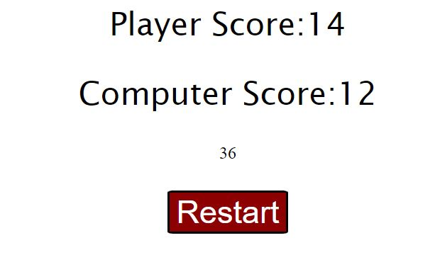

# Welcome to Rock, Paper, Scissors

Rock paper scissors is obviously a game that is all about playing rock paper scissors. It is relatively straight forward although I have added my own flare to it in my own ways. 

# Taking a look around.

# Features

Below, I will cover the features that I have implemented.

### Weapon Options 
- the three weapon options were created as clickable buttons rather than going for a Div. In my first attempts to use clickable DIVs, I was not getting the feedback loop that I required (visual confirmation of a click being registered). I tried using CSS in order to give the visual stimuli but when starting the project again (i know, silly to start over from scratch) relinking the CSS didnt seem worth it. 

- Some CSS was added in order to change the buttons aquamarine for a strong contrasting colour. According to UI standards, aquamarine can be used to highlight interactable elements. 
- Lastly, the ability to see what the player and the computer player selected each round is displayed next to the name of the player. Perhaps a pattern can be spotted...?

### statistics
- I added a winning percentage tracker. I found after a few minutes of playing the game that I had no concept, it felt like there was nothing I was working towards. Sometimes I would win and somtimes i wouldnt. I decided to add a percentage calculator to give the player stakes in the game and look for the pattern in winning percentages. 

### Keeping Score
- Similar to the statistics, I wanted to give a clear way for the player to see how often they had beat the computer and vice versa. After adding the statistics and player score, I found I could easily keep randomly clicking on options to get as high percentage as possible. 

### Terminate game 
- Understanding that everything has to come to an end at some point, I added the terminateGame function to the code. This was surprisingly challenging in the beginning as I wasnt sure how to best implemenet a reset or where to call the function in the rest of the code. 

eventually option to nest the terminateGame function in the CalculatePercentage function and adding a button as well as a game limit that resets the board. 

## Testing 
 
 Technically RPS was built with mobile first in mind but due to the simplicity of the overall design, very little was actually required in the way of media queries. 

### Version 1 
in my first attempt at this project, i tried to create a rock, paper, scissors, lizard, spock game. Although I was able to create the front end, I was struggling to make the javascript logic work in my favour. I spent several days repeatedly attempting to solve the very beginning of the code, looking at google and forms, asking AI, everything to no avail. So I decided to start fresh. 

### Version 2 
Taking the knowledge from the loss of the previous attempt, I wanted to work on something that would be a bit more basic, or so i thought. 
I began a simple "what are the odds" game. The player would have a randomly generated card and they would guess if their card was higher or lower than the computer players card. 

Although according to the console.log and strategically placed alert messages, the functions were working fine, however, perhaps due to the use of div's or incorrect use of the innerText action, I was unable to make it work. Again I went through several channels for support and everything seemed to suggest there was nothing wrong with the code itself.

### Final Version 
Starting the final version, I followed a very short guide on youtube which taught me about the document.queryselector() function and setting up event listeners. This is when the penny dropped and bounced back into the hand. 

On the one hand, it seemed as though I had found the reason for my previous versions failing completely as it seems as though the querySelector function worked as I had wanted the document.getElementsByTagName() or document.getElementById to work. 

On the other hand, I cant say will confidence why the getElementsByTagName() or getElementById() were not working in the first place... but i digress. 

I make the basic shell of a rock, paper, scissors game and continued to add additional features that made the most sense. 

Due to being already late with the hand in:
- let fullDay = 24hours; 
- let workDay = 10hours; 
- let volenteerWork = 2.5hours; 
- let partnerSupport = 2.5 hours; 
- let studyTime = 3 hours;
- let spareTime =  fullDay - (workDay + volenteerWork + partnerSupport + studyTime)
- console.log(spareTime) 

I decided that instead of making something more complicated than necessary and potentially falling into the pit of dispair of the game not working again, I opted for keeping the game simple and making my own challenges by calculating the win percentage, tracking the players wins and the computer players wins and then adding to the computerTurn function to make the computer slightly more likely to chose SCISSORS. 
### Validator Testing 
- Javascript
  - The initial results received were some minor pointers. 
    - Missing semicolons in various locations
    - TerminateGame function was not being called throughout the game properly 
  - after revisiting these minor issues in my code, i refactored the terminate game and added a reset game button. 
  - I ran the Javascript through JShint again and this is the results
    - There are 7 functions in the game 
    - functions with the largest signature take 1 arguments, while the median is 0.
    - largest function has 12 statements in it, while the median is 5. 
    - the most complex function is a cyclomatic complexity value of 8 while the median is 3. 
  - there are also a lot of statements regarding using "Let" and that it is outdated. A clear solution couldnt be found to remove those "errors". 
  - I have ran the code through coPilot a few times as well to ask if there are suggestions for improvement. It seems this can be done counless times and always find slight improvements here and there but overall the AI gods seem to approve of the work done. 
- HTML
  - when running my HTML through the suggested W3 validator, 1 error appeared regarding an H2 element that was closed with an H1 tag. quick and easy fix. 
- CSS 
  - when running the CSS through the Jigsaw W3 validator, the CSS code came back with no errors.
## Deployment 

- The site was deployed to Github pages. The steps I took to do this were as follows: 
  - In Github repository, I navigated to settings for project2-Final 
  - On the "Pages" section - I ensured the source was "deploy from branch" and the branch was set to "main" with "/root" set and saved the settings. 
  - I navigated back to the code section and refreshed the page. 
  - on the right side of the page, I selected the "deployment" section where i found the link for my deployed project
  
  The live link can be found here: [Project2-Final deployed site]().

## Credit

This section will show links to sites that guided the development process for RPS. Throughout the development process, a few sites were used to gain inspiration. 

- [font awesome](https://fontawesome.com/search?q=youtube&o=r&m=free) This was originally used for some picutes and fonts however they were removed. 
- [Code Institute](www.codeinstitute.net) - this site gave a lot of guidance going back through the "love maths" assignment. Although there were some solutions I was trying to impelemnt from CI that didnt seem to work in my favour, overall, a lot of support was found there. 
- [YouTube BroCode](https://www.youtube.com/watch?v=n1_vHArDBRA) - this was the video that I watched about making a RPS game. 
- [Youtube](https://www.youtube.com/watch?v=NJuSStkIZBg) - this was used to keep me sane. 
- [Youtube codeStack+](https://www.youtube.com/watch?v=cve1gYV7jWk) - this explained about getElementById and querySelector. 
- [Mozilla](https://developer.mozilla.org/en-US/docs/Web/Events) - i guess this helped with bug fixing? 
- [CoPilot](https://copilot.microsoft.com/) - this was an absolute lifesaver when it comes to running into roadblocks. It was able to explain the complex elements that I couldnt understand by, it helped to guide my train of thoughts with the functions and was able to spot spelling mistakes that broke the entire javascript functions. 10/10. 
- [Previous work](https://github.com/BjornBishop/Project1-final/blob/main/README.md?plain=1) - Addmittedly I took some inspiration from the PP1 as well. 

Thank you for taking the time go through my assignment. 